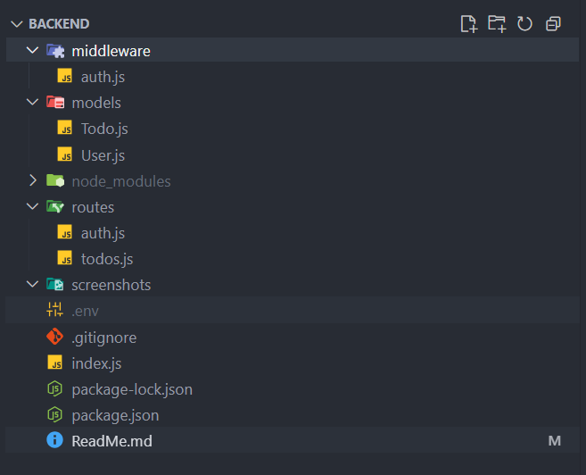
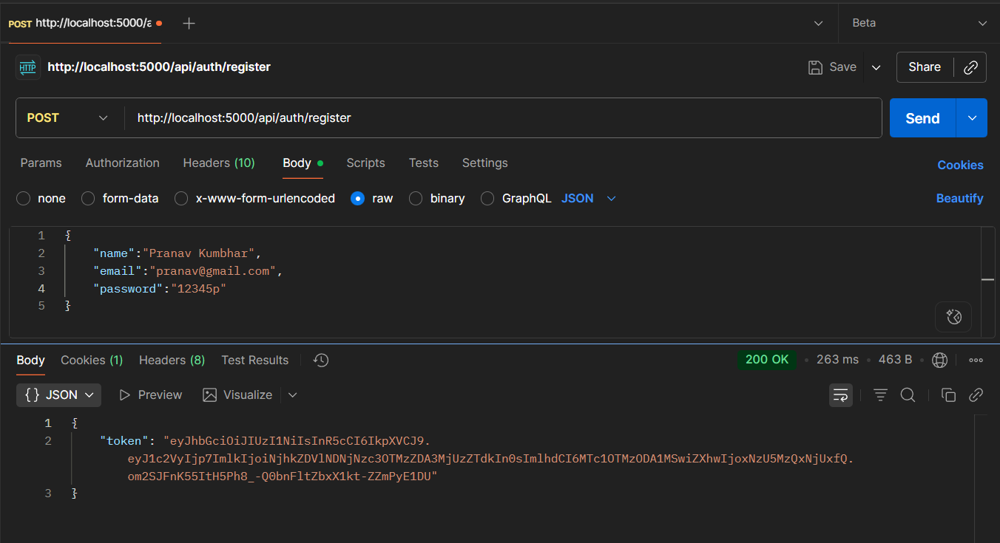
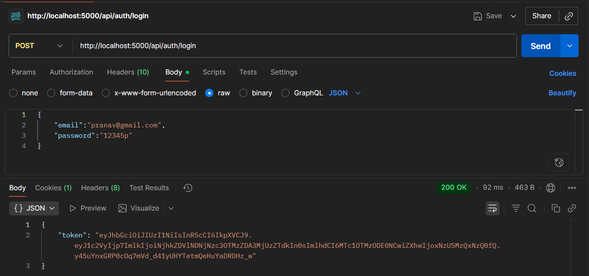
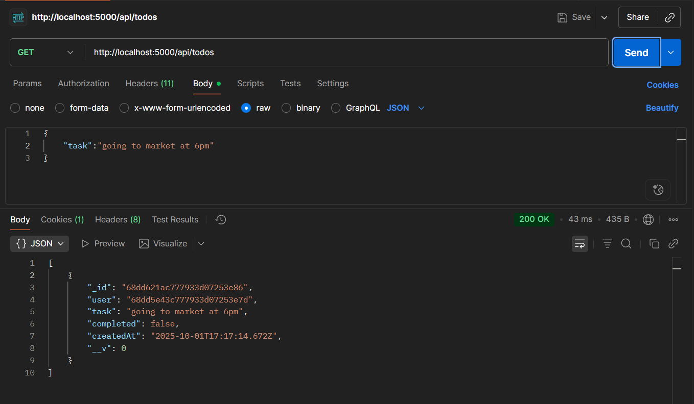
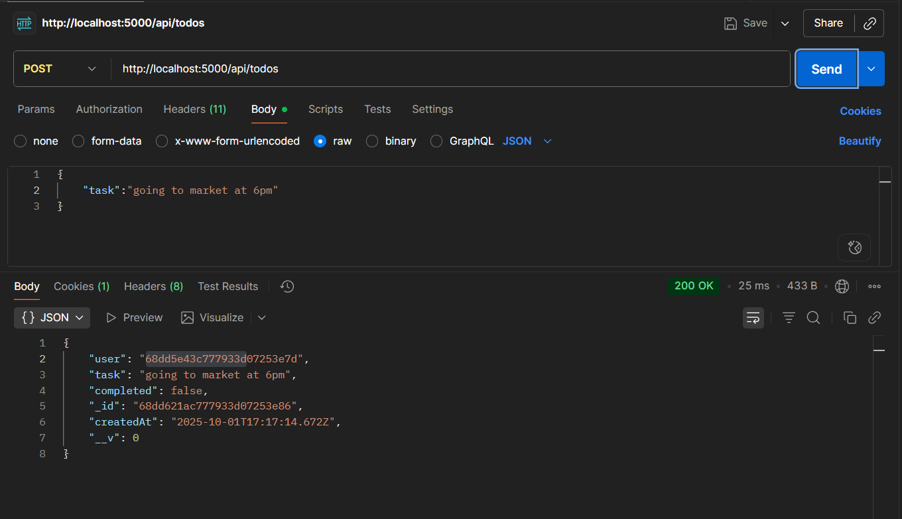

# Taskly Backend

Taskly is a backend API for managing users and their todos, built with Node.js, Express, and MongoDB. It provides authentication and CRUD operations for todo items.

## Features
- User registration and login (JWT authentication)
- Create, read, update, and delete todos
- Authentication middleware
- RESTful API structure

## Project Structure
```
backend/
├── index.js
├── package.json
├── middleware/
│   └── auth.js
├── models/
│   ├── Todo.js
│   └── User.js
├── routes/
│   ├── auth.js
│   └── todos.js
```

## Getting Started

### Prerequisites
- Node.js (v14 or higher)
- MongoDB (local or Atlas)

### Installation
1. Clone the repository:
	```powershell
	git clone <your-repo-url>
	cd Taskly/backend
	```
2. Install dependencies:
	```powershell
	npm install
	```
3. Set up environment variables:
	- Create a `.env` file in the `backend` folder:
	  ```env
	  MONGO_URI=<your-mongodb-uri>
	  JWT_SECRET=<your-secret-key>
	  PORT=5000
	  ```

### Running the Server
```powershell
npm start
```
The server runs on `http://localhost:5000` by default.

## API Endpoints

### Auth
- `POST /api/auth/register` — Register a new user
- `POST /api/auth/login` — Login and receive a JWT

### Todos
- `GET /api/todos` — Get all todos for the authenticated user
- `POST /api/todos` — Create a new todo
- `PUT /api/todos/:id` — Update a todo
- `DELETE /api/todos/:id` — Delete a todo

## Screenshots

### Folder Structure


### Register API Response Example


### Login API Response Example


### GET todo API Response Example


### Add todo API Response Example



## Notes
- This project is **not deployed**. To run locally, follow the instructions above.

## License
MIT


